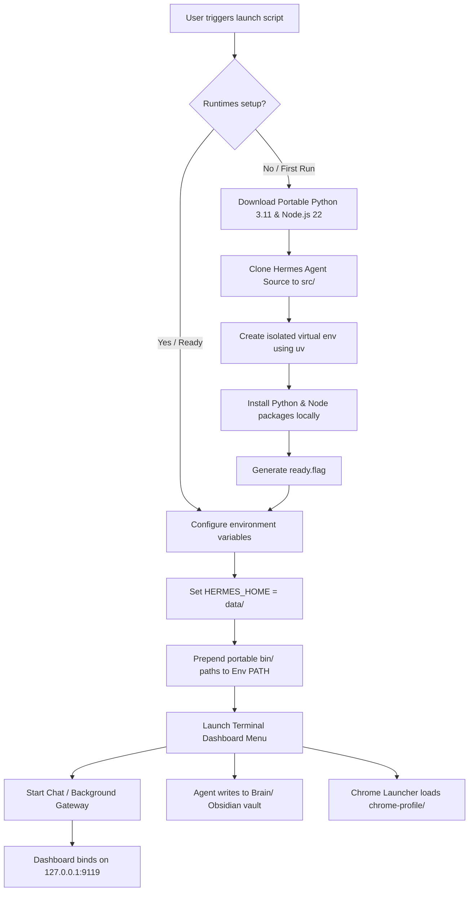

# <p align="center">🛸 Hermes Agent — Portable & Cross-Platform</p>

<p align="center">
  
  
  
  
</p>

---

<p align="center">
  <strong>Run a fully self-contained, self-improving AI agent from a single folder or USB drive.</strong><br>
  No global installation. Zero host pollution. All conversations, configs, memories, and skills stay inside your folder.
</p>

<p align="center">
  <a href="https://youtu.be/gL220WHXWeo" target="_blank">
    
  </a>
  <br>
  <em>📺 <strong>Watch the Setup & Demo Video:</strong> Click the image above to watch the step-by-step walkthrough.</em>
</p>

---

## ✨ Key Features

*    **Zero Host Dependencies**: No pre-installed Python, Node.js, or package managers required on the computer. All runtimes are downloaded locally.
*    **100% Portable**: Copy the entire directory to a USB flash drive or external SSD. Run it on any Windows, macOS, or Linux computer instantly.
*    **Obsidian Brain**: A portable long-term memory vault (`Brain/`) that travels on the USB. Maintained by the agent, viewable in Obsidian on any machine.
*    **Portable Chrome Launcher**: Carry your Chrome profile (logins, bookmarks, extensions) on the USB so you never re-login on a new PC.
*    **Web Dashboard**: Built-in FastAPI + Vite React UI served at `http://127.0.0.1:9119` for config, API keys, sessions, and in-browser chat.
*    **Safe Eject**: One menu option saves sessions, organises/verifies the Brain, flushes sync, then ejects the drive cleanly.
*    **Google Gemini via OAuth**: "Login with Google" model option — no API key or billing setup required.
*    **Fast Model Switcher**: Press `[M]` to switch between Kimi, Ollama, LM Studio, Gemini, OpenRouter, Anthropic, or custom without editing files.
*    **Interactive Console Launcher**: Includes a beautiful terminal UI dashboard with state-tracking for setup status, LLM providers, and background gateways.
*    **True Privacy & Isolation**: Your API keys (`data/.env`), conversations (`data/sessions/`), OAuth credentials (`data/auth/`), persistent memory, and custom skills are kept strictly within the portable folder.
*    **Full Hermes Capabilities**: Retains all features of [Nous Research's Hermes Agent](https://github.com/NousResearch/hermes-agent), including memory storage and reusable skill generation.

---

## ⚡ Quick Start

Get Hermes running in seconds depending on your operating system:

### Windows (10 / 11)
Simply double-click the **`launch.bat`** file in this folder.
> *Note: On first run, it will launch a PowerShell window to download dependencies and configure your runtime environment.*

On first run the launcher also detects the Obsidian Brain (`Brain/` vault) and wires it automatically — open Obsidian on any PC and use **`File → Open Vault → Brain/`** to view it.

###  macOS & Linux
Open your terminal in this directory and execute:
```bash
chmod +x launch.sh
./launch.sh
```

> 💡 **macOS Double-Click Shortcut:** If you want to double-click in Finder to launch, rename `launch.sh` to `launch.command`. macOS recognizes `.command` files and opens them in Terminal automatically.

> 🐧 **Linux + exFAT drives (auto-handled):** exFAT — the format that lets one drive work on Windows, macOS **and** Linux — can't store symlinks on Linux, which used to break first-run setup (`tar: Cannot create symlink … Operation not permitted`). Since **portable-v1.6.0** the setup detects this automatically: it unpacks the runtime on local disk and copies it back as plain files, and keeps the Python virtual-env on local disk (rebuilt on demand). No action needed — just run `./launch.sh`. (Browser/Playwright web-automation tools remain limited on exFAT-Linux; everything else works.)

---

## 🧠 Obsidian Brain Setup

The `Brain/` directory is a full [Obsidian](https://obsidian.md/) vault that travels with your USB. It holds long-term memory, journals, concepts, skills, and device notes — all maintained by Hermes during sessions.

**To view it:**
- Open Obsidian on any machine (Windows, macOS, Linux)
- Click **Open Vault → Brain/** (the entire vault is already on the USB)
- No sync service needed — your vault is always on the drive

The launcher automatically sets `OBSIDIAN_VAULT_PATH` so agents can read from and write to the Brain during sessions. After each session, Safe Eject (`[5]`) verifies the vault and writes `Brain/.hermes-safe-eject.json` as a consistency marker.

**Brain structure:**
```
Brain/
├── memories/          # Long-term agent memories
├── journals/          # Session journals and dated notes
├── concepts/          # Concept notes and definitions
├── skills/            # Learned skill documents
└── devices/           # Per-machine context and handoff notes
```

> ℹ️ **macOS note**: use `hdiutil attach` to mount the USB volume before accessing Brain/ on macOS.

See [docs/SAFE-EJECT.md](docs/SAFE-EJECT.md) for the full Safe Eject workflow.

---

## 🌐 Portable Chrome Launcher

Carry your Chrome profile — logins, bookmarks, extensions, everything — on the USB so you never re-login on a new PC.

**Quick Start:**
1. **Import your current profile** (one-time, then you're set):
   ```
   chrome-launcher\launch-chrome.py --import
   ```
2. **Launch Chrome** from anywhere:
   ```
   chrome-launcher\launch-chrome.py [URL]
   ```
   Or just double-click `chrome-launcher\chrome.bat`

**How it works:**
- Uses the host PC's Chrome executable (already installed on most PCs)
- Loads your profile from `chrome-profile/User Data/Default` on the USB
- Saves downloads to `chrome-downloads/` on the USB
- Excludes large transient caches (GPUCache, Code Cache, Service Worker cache) to keep the profile ~400 MB smaller

**Moving to a new PC:**
1. Plug in the USB
2. Run `chrome-launcher\chrome.bat`
3. Your YouTube Premium, Google Account, bookmarks — everything is already logged in

**Update the profile after changes on a host PC:**
```
python chrome-launcher\launch-chrome.py --import --force
```
Close Chrome first. This copies updated profile data back to the USB.

For full details see [chrome-launcher/README.md](chrome-launcher/README.md).

---

## ⚙️ How It Works (Under the Hood)

Hermes Portable solves the host-dependency issue by establishing a sandboxed runtime context pointing inwards.



### The Isolation Design
1. **Custom Data Directory**: The launcher overrides `HERMES_HOME` to the local `data/` folder, forcing Hermes to write configuration and data locally rather than in `~/.hermes/`.
2. **Local Path Sandboxing**: The scripts download self-contained Python and Node.js binaries into `.cache/runtimes/` and prepend them directly to the active process `PATH`.
3. **No Registry/Host Pollution**: System configurations, environment variables, or packages on the host machine are left untouched.

---

## 📁 Workspace Directory Structure

A clean, modular layout where runtime caches are separated from your personal configurations.

```yaml
hermes-portable/
├── launch.bat                 # Windows interactive launcher script
├── launch.sh                  # macOS & Linux interactive launcher script
├── chrome-launcher/           # Portable Chrome profile launcher
│   ├── launch-chrome.py       # Imports & launches Chrome with portable profile
│   ├── chrome.bat             # Double-click launcher for Windows
│   └── README.md              # Full Chrome launcher docs
├── scripts/
│   ├── setup-windows.ps1      # Windows first-run configuration script
│   ├── setup-unix.sh          # Unix (macOS/Linux) first-run configuration script
│   └── safe-eject.sh          # Safe USB eject workflow
├── Brain/                     # Obsidian vault — long-term memory + knowledge base
│   ├── memories/              # Long-term agent memories
│   ├── journals/              # Session journals and dated notes
│   ├── concepts/              # Concept notes and definitions
│   ├── skills/                # Learned skill documents
│   └── devices/               # Per-machine context and handoff notes
├── chrome-profile/            # Portable Chrome user profile (on USB)
│   └── User Data/Default/
├── chrome-downloads/          # Chrome downloads saved to USB
├── data/                      # ⚠️ [BACKUP THIS] All your private files
│   ├── config.yaml            # Hermes LLM provider configurations
│   ├── .env                   # API Keys and active credentials
│   ├── auth/                  # OAuth credentials (google_oauth.json, etc.)
│   ├── sessions/              # Chronological chat histories
│   ├── memories/              # Persistent memory databases
│   ├── skills/                # Learned custom skills
│   └── logs/                  # Runtime and dashboard logs
├── docs/                      # Feature documentation
│   ├── DASHBOARD.md           # Web dashboard setup & troubleshooting
│   ├── GEMINI-LOGIN.md        # OAuth Gemini sign-in guide
│   ├── SAFE-EJECT.md          # Safe eject workflow reference
│   └── UPDATING.md            # Syncing from upstream hermes-agent
├── src/                       # Downloaded Hermes Agent source code (gitignored)
│   └── hermes-agent/
└── .cache/                    # Sandbox cache & binaries
    └── runtimes/              # Platform-specific portable interpreters
        ├── windows-x64/
        ├── macos-arm64/
        ├── macos-x64/
        ├── linux-x64/
        └── linux-arm64/
```

---

## 🗝️ Setup API Keys & Model Selection

To configure your language models, open and edit the environment variables in `data/.env`:

```env
# Add the keys for the providers you wish to use:
OPENROUTER_API_KEY=sk-or-v1-xxxxxxxxxxxxxxxx
OPENAI_API_KEY=sk-proj-xxxxxxxxxxxxxxxx
ANTHROPIC_API_KEY=sk-ant-xxxxxxxxxxxxxxxx
GEMINI_API_KEY=                          # Optional — Gemini via API key
```

Alternatively, you can select option **`[2]` (Setup / Reconfigure)** in the Launcher Terminal Menu to configure model providers interactively.

**No API key?** Use **`[4] Google Gemini — login with Google (OAuth, no API key)`**. A browser window opens for Google sign-in; credentials are stored in `data/auth/google_oauth.json` on the USB and travel with the drive. See [docs/GEMINI-LOGIN.md](docs/GEMINI-LOGIN.md) for models, troubleshooting, and the Google ToS note.

### Model Switcher

Press **`[M]`** at the main menu (or select **`[3]`**) to switch between all available providers and models without editing any files:

| # | Provider | Auth Method |
|---|----------|-------------|
| `[1]` | Kimi ( moonshot) | API key |
| `[2]` | Ollama | API key (local) |
| `[3]` | LM Studio | API key (local) |
| `[4]` | Google Gemini | **Login with Google (OAuth)** |
| `[5]` | Google Gemini | API key (cloud) |
| `[6]` | OpenRouter | API key |
| `[7]` | Anthropic | API key |
| `[8]` | Custom | API key + custom base URL |

---

## 🖥️ Dashboard

A browser-based UI for managing Hermes — model/provider config, API keys, sessions, and in-browser chat.

**Open it:**
- From the launcher, press **`[D] Open Dashboard`**
- Or run `hermes dashboard --skip-build` from a terminal inside the vault

The dashboard is served at **`http://127.0.0.1:9119`** (localhost only).

**First-launch behaviour:** The server cold-starts in ~60-90 seconds (plugin discovery loads off the USB). The launcher **waits for the server to actually bind** before opening your browser, so you will never see a blank "connection refused" page. Subsequent launches are faster, and if the server is already running it re-opens the tab instantly.

**What's included:**
- Model / provider configuration panel
- API key management
- Session browser and chat history
- In-browser chat (powered by the active Hermes session)
- System stats (gateway status, memory, disk)

**Security:**
- Bound to **`127.0.0.1` only** — never reachable from the network by default.
- The SPA carries an **ephemeral session token** injected at serve time; every `/api/*` call requires it.
- **Do not pass `--insecure`** on an untrusted network — it would expose your API keys.

**Stopping the dashboard:** `hermes dashboard --stop`, or press Ctrl-C in the terminal that launched it.

For troubleshooting see [docs/DASHBOARD.md](docs/DASHBOARD.md).

---

## 🔒 Safe Eject

Always use Safe Eject before removing the USB. It saves session state, organises the Brain, flushes writes, and ejects the drive cleanly — so you never lose work or corrupt the vault.

**From the launcher:**
```
./launch.sh   →   [5] Eject USB Safely   →   confirm [y]
```

**Standalone:**
```bash
scripts/safe-eject.sh            # interactive
scripts/safe-eject.sh --yes      # skip the confirm prompt
scripts/safe-eject.sh --dry-run  # save / organise / sync — skip eject (safe to test)
```

**What it does (step by step):**
```
[1] Stop gateway     hermes gateway stop        (releases live file handles)
[2] Save sessions    flush data/sessions/*  +   append close-out to Brain/log.md
[3] Organise Brain   scan notes, verify [[wikilinks]], write .hermes-safe-eject.json
[4] Sync             sync; sync                 (flush all writes to USB)
[5] Eject            detect volume → eject via detached helper
```

- **macOS:** `diskutil eject "/Volumes/<NAME>"`
- **Linux:** `udisksctl unmount` + `power-off` (falls back to `umount`)

**If eject is blocked** something still holds the volume open:
| Holder | Fix |
|---|---|
| A shell `cd`'d into the drive | `cd ~` in that terminal |
| Obsidian app open on the Brain | Quit Obsidian |
| VM / sandbox with the folder mounted | Disconnect the folder |
| Spotlight indexing (macOS) | `sudo mdutil -i off "/Volumes/<NAME>"` then retry |

**Safety guarantees:**
- A confirm prompt guards every run (cancel returns to menu, exit code 10).
- Nothing is ever deleted — only save, organise, sync, and unmount.
- Even if auto-eject fails, data is already synced; a manual eject is safe.

After a clean eject, `Brain/.hermes-safe-eject.json` records `{last_safe_eject, note_count, broken_links}` for the next AI session to read.

Full reference: [docs/SAFE-EJECT.md](docs/SAFE-EJECT.md).

---

## 📦 Cache & Runtime Footprint

| Component | Storage Size | Notes |
| :--- | :--- | :--- |
| **Launchers & Scripts** | ~50 KB | Metadata and setup automation scripts |
| **Per-Platform Runtime** | ~600 – 900 MB | Includes Python, Node, uv, and pip caches |
| **Hermes Source Code** | ~50 MB | Cloned Git repository |
| **Chrome Profile** | ~400 MB | Portable Chrome profile with caches excluded |
| **User Data** | ~10 MB → 2 GB+ | Grows as memory and chat history expand |

> ℹ️ *Note: If you run this folder across multiple operating systems (e.g., Windows at home and macOS at work), the `.cache/runtimes/` folder will scale to store the respective platforms (~1.8 GB total).*

---

## 🔄 Updating Hermes Agent

Keep your agent up-to-date with the latest improvements from Nous Research:

*   **Via Chat Command**: Within an active Hermes conversation, type:
    ```text
    /hermes update
    ```
*   **Via Launcher**: Navigate to `[4] Advanced Options` -> `[5] Update Hermes` in the Launcher terminal dashboard.
*   **Manual Rebuild**: Delete `.cache/runtimes/<your-platform>` and the `src/hermes-agent` directory, then re-run the launcher to fetch the latest code from scratch.

> ℹ️ The `VERSION` file pins the portable wrapper version to the exact upstream `hermes-agent` commit it was last verified against. See [docs/UPDATING.md](docs/UPDATING.md) for the full sync + bump + push workflow.

---

## 🏷️ Versioning & Releases

This repo follows a **portable-specific** versioning scheme separate from the upstream hermes-agent:

| Field | Meaning |
|---|---|
| `portable_version` (`portable-vX.Y.Z`) | The launcher, scripts, and docs in **this** repo. Bump on wrapper changes. |
| `hermes_agent_commit` | The exact upstream `hermes-agent` commit `src/` is synced to (recorded in `VERSION`). |

Tagged releases range from **`portable-v1.0.0`** through **`portable-v1.4.1`**. Each tag is pushed to GitHub and is auditable.

- **`VERSION`** — pairs the portable wrapper version with the bundled hermes-agent commit; updated on every sync.
- **`CHANGELOG.md`** — tracks all portable-specific changes. Read it before updating to see what changed.
- **Upgrade path**: sync source → update `VERSION` → commit → tag → push. See [docs/UPDATING.md](docs/UPDATING.md).

---

## 🔒 Security Advisory

> [!WARNING]
> **Your portable directory contains your identity.**
> Because `data/.env` stores raw API keys, `data/sessions/` contains logs of your conversations, `data/auth/` holds your Google OAuth credentials, and `chrome-profile/` contains your browser identity, anyone with access to your portable drive can access your accounts.
>
> *   **Recommended Action**: Encrypt your USB flash drive or SSD using **BitLocker** (Windows), **FileVault** (macOS), or a cross-platform utility like **VeraCrypt**.
> *   Avoid storing large API balances or production keys on drives you carry daily.

---

## 🔍 Troubleshooting & FAQ

<details>
<summary><strong>First-run setup fails or times out</strong></summary>

*   Verify your internet connection (the setup downloads ~600 MB of data).
*   Some corporate/school firewall settings block Node.js CDNs or GitHub releases. Try configuring a VPN.
*   Delete the `.cache/` folder and launch again to clean-install the runtimes.
</details>

<details>
<summary><strong>Linux: setup aborts with "tar: Cannot create symlink … Operation not permitted"</strong></summary>

*   This is the exFAT-on-Linux symlink limitation, **fixed automatically in portable-v1.6.0+** — pull/update the launcher and re-run `./launch.sh`. Setup now stages the runtime on local disk and copies it back as plain files (symlinks dereferenced), and builds the Python venv on local disk.
*   If you previously hit this on an older version, the half-built runtime is harmless to discard: `rm -rf .cache/runtimes/linux-x64` then `./launch.sh`.
*   The venv lives at `/tmp/hermes-portable-venv-<id>` and is rebuilt automatically if a reboot clears `/tmp` (the launcher detects it on start). The pointer is saved in `.cache/runtimes/linux-x64/venv.path`.
*   Browser/Playwright web-automation tools stay limited on exFAT-Linux (their browser binaries also need symlinks); pick a different filesystem (ext4) if you need them.
</details>

<details>
<summary><strong>Dashboard shows a blank page or "connection refused"</strong></summary>

*   On first launch the server takes ~60-90 seconds to cold-start. The launcher now waits for the server to respond before opening the browser — if you opened it manually too early, wait for the "Dashboard ready at http://127.0.0.1:9119" message in the terminal, then refresh.
*   If the SPA assets are missing, rebuild with: `cd src/hermes-agent/web && npm install && npm run build`.
*   If a stale server is holding the port: `hermes dashboard --stop`, then re-open the dashboard.
*   See [docs/DASHBOARD.md](docs/DASHBOARD.md) for full troubleshooting.
</details>

<details>
<summary><strong>Chrome profile not found / login not carrying over</strong></summary>

*   Run the import step once on the machine where your current Chrome profile lives:
    ```
    chrome-launcher\launch-chrome.py --import
    ```
    Then launch with `chrome-launcher\chrome.bat` — your logins, bookmarks, and extensions will be there on any PC.
*   To sync profile changes made on a host PC back to the USB: `python chrome-launcher\launch-chrome.py --import --force` (close Chrome first).
*   See [chrome-launcher/README.md](chrome-launcher/README.md).
</details>

<details>
<summary><strong>USB eject is blocked — "volume in use"</strong></summary>

*   A shell may be `cd`'d into the drive: `cd ~` in that terminal.
*   Obsidian may have the Brain vault open: quit Obsidian.
*   A VM or sandbox may have the folder mounted: disconnect it.
*   On macOS Spotlight may be indexing: `sudo mdutil -i off "/Volumes/<NAME>"` then retry.
*   Your data is already synced — a manual `diskutil eject` / `umount` is safe after a failed Safe Eject.
*   See [docs/SAFE-EJECT.md](docs/SAFE-EJECT.md).
</details>

<details>
<summary><strong>macOS: "cannot be opened because the developer cannot be verified"</strong></summary>

*   Right-click `launch.sh` (or `launch.command`), choose **Open With** and select **Terminal**.
*   Alternatively, open terminal and strip macOS quarantine flags using:
    ```bash
    xattr -dr com.apple.quarantine /path/to/hermes-portable
    ```
</details>

<details>
<summary><strong>Windows Defender flags the launcher scripts</strong></summary>

*   This is a false positive caused by PowerShell scripts downloading files from remote sources (GitHub & Node.js servers).
*   Click **"More info"** on the Windows SmartScreen dialog, then click **"Run anyway"**.
*   The setup scripts are fully open-source and human-readable under the `scripts/` directory for your inspection.
</details>

<details>
<summary><strong>Hermes is running slowly from my flash drive</strong></summary>

*   Older USB 2.0 drives have slow read/write speeds, which bottleneck Python's module imports.
*   **Solution**: Upgrade to a **USB 3.0 / 3.1** drive, or an **external SSD** for optimal performance.
</details>

<details>
<summary><strong>Playwright / Web Browser tools are failing</strong></summary>

*   Some OS sandboxing policies restrict web browsers (Chromium/Firefox) from starting directly inside external/removable directories.
*   **Solution**: Copy the `hermes-portable` directory onto the local SSD and run from there.
</details>

---

## 📝 Credits & Attribution

*   **[Hermes Agent](https://github.com/NousResearch/hermes-agent)** — Powerful Agentic core created by [Nous Research](https://github.com/NousResearch).
*   **[python-build-standalone](https://github.com/indygreg/python-build-standalone)** — Portable Python interpreter compilation.
*   **[uv](https://github.com/astral-sh/uv)** — Blazing fast package installer and resolver.
*   **[Obsidian](https://obsidian.md/)** — Markdown-based knowledge base used for the portable Brain vault.